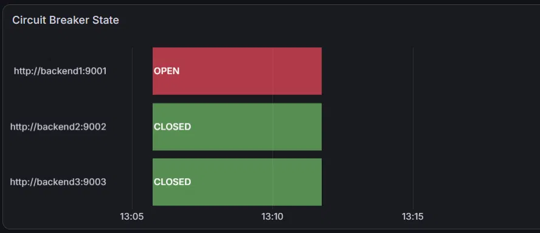
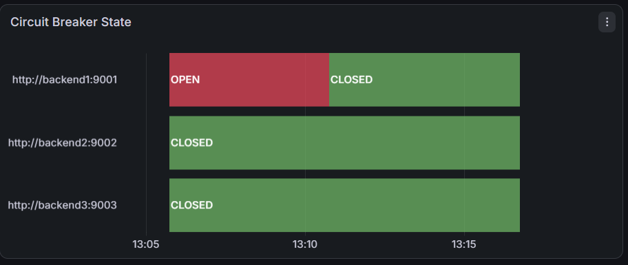

# Chaos Engineering Runbook

Real chaos experiments run against resilient-lb, documenting purpose,
method, evidence, and findings.

---

## EXP-001 — Circuit Breaker Opens Under Chaos-Injected Errors

**Status:** complete · **Date:** 2026-07-16

### Purpose
Verify the circuit breaker treats chaos-injected HTTP 503s as real
failures, without affecting unrelated backends or health checks.

### Success Criteria
- `backend1` circuit breaker → `open` after 5 consecutive failures
- `backend2`/`backend3` circuit breakers stay `closed`
- `backend1` health check still reports `healthy: true`

### Method
```bash
curl -X POST http://localhost:8888/chaos/inject \
  -H "Content-Type: application/json" \
  -d '{"type":"error","target":"http://backend1:9001","error_code":503,"probability":1.0,"duration_sec":120}'

for i in $(seq 1 30); do curl -s http://localhost:8080 > /dev/null; done
curl http://localhost:8888/backends
```

### Results
```json
{"url":"http://backend1:9001","healthy":true,"circuit_breaker":"open"}
{"url":"http://backend2:9002","healthy":true,"circuit_breaker":"closed"}
{"url":"http://backend3:9003","healthy":true,"circuit_breaker":"closed"}
```



### Findings
Initial run failed silently — `applyCI()` returned before the circuit
breaker's failure path ran, so chaos errors weren't counted. Fixed by
explicitly calling `CircuitBreaker.Failure()` for `error`, `drop`, and
`killswitch` types.

### Conclusion
Chaos-induced failures are indistinguishable from real ones to the
circuit breaker — confirming it protects against genuine outages.

---

## EXP-002 — Circuit Breaker Recovers After Chaos Clears

**Status:** complete · **Date:** 2026-07-16

### Purpose
Confirm the circuit breaker returns to `closed` once the underlying
failure (real or simulated) stops, via the half-open probe cycle.

### Success Criteria
- Circuit breaker transitions `open → half-open → closed` within
  one health-check interval after chaos is cleared

### Method
```bash
curl -X DELETE http://localhost:8888/chaos/clear
sleep 30
curl -s http://localhost:8080 > /dev/null
curl http://localhost:8888/backends
```

### Results
`backend1` circuit breaker returned to `closed` after the first
successful half-open probe following chaos removal.



### Findings
While chaos remained active, the circuit breaker correctly cycled
`open → half-open → open` every 30s, since each probe still hit a
simulated failure. It only closed once the real signal (no more
injected errors) allowed a probe to succeed — confirming the breaker
doesn't recover prematurely while the underlying problem persists.

### Conclusion
Recovery behavior matches production expectations: the system heals
automatically, but only once the fault is actually gone.